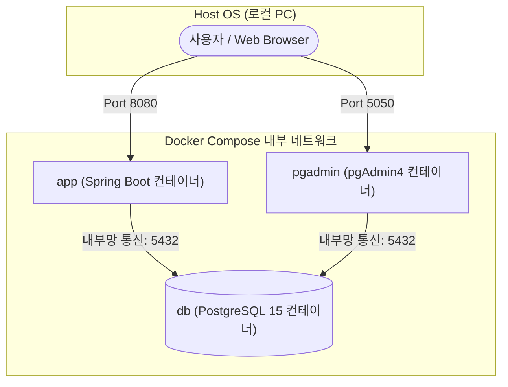

# Bedrock App Backend - 시스템 설계서 (Architecture)

## 1. 프로젝트 개요
본 프로젝트는 Spring Boot 기반의 백엔드 API 서버입니다. 
애플리케이션과 데이터베이스 인프라를 Docker Compose를 통해 컨테이너화하여, 로컬 개발 환경과 배포 환경의 일관성을 유지합니다.

## 2. 기술 스택 (Tech Stack)
* **Language**: Java 21
* **Framework**: Spring Boot
* **Database**: PostgreSQL 15
* **ORM/Data Access**: Spring Data JPA / Hibernate
* **Infrastructure**: Docker, Docker Compose
* **DB Management**: pgAdmin4

## 3. 인프라 아키텍처 (Infrastructure)
애플리케이션과 연관 서비스들은 `docker-compose.yml`을 통해 하나의 내부 네트워크에서 동작합니다.



* **`db` (PostgreSQL)**: 메인 데이터베이스. `postgres_data` 볼륨을 통해 컨테이너가 재시작되어도 데이터가 영구적으로 보존됩니다.
* **`app` (Spring Boot)**: 멀티 스테이지 빌드(Gradle 빌드 -> JRE 실행)가 적용된 `Dockerfile`을 통해 구동되는 API 서버 컨테이너입니다.
* **`pgadmin`**: 데이터베이스 상태를 웹 UI(Port 5050)에서 확인하고 쿼리를 실행할 수 있는 관리 툴입니다.

## 4. 디렉토리 구조 (Directory Structure)
```text
app-backend/
├── .env                    # 환경 변수 (Git 추적 제외)
├── docker-compose.yml      # 도커 인프라 설정
├── Dockerfile              # 스프링 부트 앱 빌드 및 실행 이미지 명세
├── build.gradle            # 프로젝트 의존성 관리
└── src/main/java/com/bedrock/app/
    └── debug/              # DB 연결 테스트 및 기본 세팅 검증용 모듈
        ├── DebugController.java
        ├── DebugService.java
        ├── DebugRepository.java
        └── DebugEntity.java
```

## 5. 데이터 흐름 (Data Flow)
1. 외부 클라이언트가 `http://localhost:8080/api/...` 로 요청을 보냅니다.
2. `app` 컨테이너의 Controller가 요청을 받아 Service 계층으로 넘깁니다.
3. Service 계층에서 비즈니스 로직을 처리한 뒤 Repository(JPA)를 호출합니다.
4. JPA가 환경 변수(`.env`)로 주입된 접속 정보를 바탕으로 도커 내부 네트워크의 `db:5432`에 쿼리를 실행합니다.
