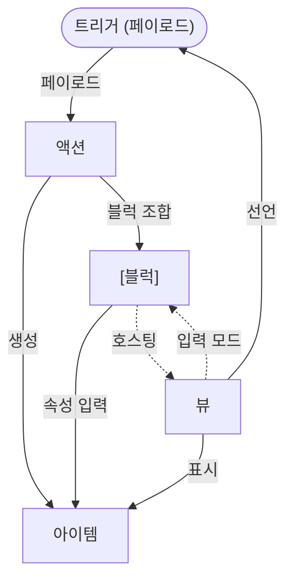

# 개념 모델 v1.3

> **목적:** 베드락의 어휘를 한 장에 박는다. 모든 후속 문서는 이 문서의 정의를 참조한다.
> 

> **1차 독자:** 베드락 팀 전원
> 

> **버전:** v1.3 (2026-07-06) — 앱 목적 도입, 파이프라인 개념 제거, 블럭 = 속성 집합으로 재정의 | **근거:** ADR-11·17·18·19·21·27
> 

---

## v1.2 → v1.3 변경 사항

이전 버전(v1.2)과 비교해 이 문서를 처음 보는 팀원이 알아야 할 핵심 변화.

| 항목 | v1.2 (이전) | v1.3 (현재) |
| --- | --- | --- |
| **문서 시작** | 기술 패러다임 코드(`트리거 → [블럭 → ...] → 뷰`)부터 시작 | 앱 정의·타겟·핵심 가치부터 시작 |
| **블럭 정의** | 파이프라인의 단계 — 순서대로 실행되는 입력 단위 | **특정 속성들의 집합** — 순서 개념 없음 |
| **액션 정의** | `트리거 → [블럭 → 블럭 → ...] → 종료 뷰` 파이프라인 | 트리거 + 블럭 조합. 종료 뷰 없음 |
| **생성 후 이동** | 액션마다 지정된 종료 뷰로 이동 | 항상 트리거 발생 뷰로 복귀 + 모달 |
| **컨텍스트 누적** | 블럭이 순서대로 컨텍스트를 쌓아 전달 | 제거 — 트리거 페이로드가 속성 초기값으로 직접 활용 |
| **용어 섹션** | 5계층 기술 정의만 | 컬렉션·프리셋·의미 그룹·인스턴스화·링크 타입 추가 |
| **캘린더 트리거** | `date_click` → 생성 | `date_double_click` → 생성 (ADR-031, `date_click`은 상세 패널로 변경) |
| **프리셋 카탈로그** | 개념 모델 §5 인라인 | `functional-spec/presets.md`로 분리 |

---

## 1. 베드락이란

**한 줄 정의:** **일정 관리 앱**.

**차별화 기능:** 프리셋 동작으로 즉시 생성하고, 자기 입력 흐름을 조립할 수 있음. 유연성 있는 아이템.

**1차 타겟:** 한국 4년제 대학 재학생·휴학생 - 수업·알바·팀플 등 동시에 돌아가며 일정이 여러 앱에 흩어지는 상황을 해결한다.

---

## 2. 사용자가 하는 일

아이템을 보고(1)와 만들(2) 수 있다.

### 보기

사용자는 **모듈(뷰)** 을 통해 아이템을 확인한다. 같은 아이템이 여러 뷰에 동시에 나타날 수 있다.

| 모듈 | 무엇을 보여주는가 |
| --- | --- |
| **캘린더** | 시간 기반 일정. 월간·주간·일간 전환 |
| **투두** | 상태(할 일·진행 중·완료) 기반 할 일 목록 |
| **메모** | 마크다운 노트. 날짜 또는 할 일 필드를 가지면 캘린더·투두에도 등장 |
| **시간표** | 주간 반복 강의 정의 + 학기별 관리 |
| **대시보드** | 오늘 일정·다가오는 일정·잔디(Streak) 등 전체 현황 |

### 만들기 - 프리셋으로 시작

베드락에서 아이템을 만드는 가장 빠른 방법은 **프리셋** 을 실행하는 것이다. 모듈에서 특정 동작(클릭·드래그·FAB 탭)을 하면 입력 화면이 열리고, 정보를 채우면 아이템이 생성된다.

프리셋은 앱에서 제공하는 기본적인 일정 생성 기능을 의미한다.

일반적인 일정관리 앱에서 제공하는 일정 아이템을 생성하는 기능을 프리셋으로 제공한다.

그와 더불어, 타겟에 최적화된 복합적인 일정 아이템을 생성하는 기능도 프리셋으로 제공될 수 있다.

> 실제 프리셋 정의는 functional-spec/[presets.md](http://presets.md) 참조.
> 

---

## 3. 용어 정리

### 3.1 아이템 (Item)

사용자가 만들고 소유하는 데이터의 기본 단위.

| 속성 | 설명 |
| --- | --- |
| 구조 | 공통 컬럼(`id`, `name`, `owner_id` 등) + 평탄한 `attributes` JSONB |
| 타입 | 없음. **가진 필드의 조합으로 성격이 결정됨** — `start_at` 있으면 캘린더에 등장, `content` 있으면 메모에 등장 |
| 생명주기 | 생성 시점의 스냅샷 — 프리셋 정의가 나중에 바뀌어도 기존 아이템에 영향 없음 |
| 연결 | 아이템 간 관계는 `item_links` 테이블로 표현. 수동 연결 우선 |

> 상세 스키마 및 MVP 필드 카탈로그: 데이터 모델 §2 참조
> 

#### 3.1.1 아이템 링크 속성 (Link Type)

`item_links`에서 아이템 간 관계의 종류를 구분하는 값.

아이템을 구성하는 컬럼의 일종으로, 아이템 간의 연결을 위한 속성이다.

| link_type | 의미 | 생성 방식 |
| --- | --- | --- |
| `reference` | 메모에서 다른 아이템을 인라인 참조 | 위키링크(`[[]]`) 파싱 시 자동 생성 |
| `parent_child` | 계층 관계 (상위·하위 아이템) | 수동 연결 |
| `derived_from` | 원본에서 파생된 아이템 | 인스턴스화 시 자동 생성 |

### 3.2 모듈·뷰 (Module / View)

**모듈** 은 하나의 기능 단위다 (예: 캘린더 모듈). 모듈은 **뷰 모드** (아이템을 표시)와 **블럭 모드** (아이템을 입력)를 가진다.

| 모드 | 역할 |
| --- | --- |
| 뷰 모드 | 아이템을 특정 방식으로 표시 + 사용자 동작(트리거) 발생 |
| 블럭 모드 | 아이템의 특정 속성 집합을 입력받는 화면 |

**한 아이템이 여러 뷰에 등장할 수 있다** - 뷰가 선언한 관심 필드를 가진 아이템이면 해당 뷰에 표시된다 (N:M 관계).

> 근거: ADR-19 (타입 제거·필드 보유 기반 등장)
> 

**모드 호칭 컨벤션:**

| 모듈 | 뷰 모드 호칭 | 블럭 모드 호칭 |
| --- | --- | --- |
| **캘린더** | 캘린더 뷰 | 캘린더 블럭 |
| **메모** | 메모 뷰 | 메모 블럭 |
| **시간표** | 시간표 뷰 | 시간표 블럭 |
| **투두** | 투두 뷰 | 투두 블럭 |
| **대시보드** | 대시보드 뷰 | (블럭 모드 미지원) |

> **각 모듈에 해당하는 상세 기능은 각 모듈별 기능 명세 문서를 확인하자.**
> 

### 3.3 컬렉션 (Collection)

아이템을 그룹화하는 단위. 모든 아이템은 하나의 컬렉션에 속한다.

> 아이템:컬렉션 = N:1의 관계.
> 

| kind | 역할 | 예시 |
| --- | --- | --- |
| `calendar` | 캘린더 단위 (개인·공유) | "내 일정", "팀플 캘린더" |
| `notebook` | 메모 노트북 | "강의 노트", "아이디어 메모" |
| `semester` | 시간표 학기 단위 | "2026 1학기" |

> 상세 스키마: 데이터 모델 §4 참조
> 

> **색·아이콘:** 각 컴렉션은 `color`·`icon`을 가진다(예: 캘린더 색). **아이템 색 = 2-tier** — 아이템이 자기 `color`를 가지면 그 색, 없으면 **소속 컴렉션(캘린더) 색을 상속**한다(아이템 색 우선).
> 

### 3.4 프리셋 (Preset)

베드락이 시드로 제공하는 액션. 사용자가 별도로 만들지 않아도 앱 설치 시 기본 제공된다.

| 종류 | 설명 |
| --- | --- |
| 기본 프리셋 (11종) | 단일 블럭. 각 모듈의 기본 생성 진입점 (`empty_click`, `empty_drag`, `fab_click` 등) |
| 복합 프리셋 (4종, SC-1~4) | 2개 이상 블럭 조합. 타겟에 최적화된 시나리오형 생성 흐름 |

> 카탈로그 정본: functional-spec/[presets.md](http://presets.md)
> 

### 3.5 의미 그룹 (Semantic Group)

액션 실행 시 여러 블럭의 속성들을 도메인 성격별로 묶어 한 화면에 표시하는 UI 단위. 사용자는 "캘린더 블럭", "메모 블럭" 이름 대신 의미 그룹 레이블을 본다.

| 의미 그룹 | 포함 속성 예시 |
| --- | --- |
| 기본 | `name`, `tags` |
| 일정 | `start_at`, `end_at`, `location`, `alarm` |
| 할일 | `status`, `due_at`, `priority` |
| 노트 | `content` |
| 시간표 | `day_of_week`, `start_time`, `end_time`, `room` |

### 3.6 인스턴스화 (Instantiation)

시간표 아이템(반복 강의 정의)을 실제 캘린더 아이템으로 파생 생성하는 과정. 시간표 아이템이 생성·수정될 때, 학기 범위 내 해당 요일의 날짜마다 캘린더 아이템이 자동으로 만들어진다.

- 생성된 캘린더 아이템은 원본 시간표 아이템과 `derived_from` 링크로 연결됨
- 베드락 고유 개념 — 일반 캘린더 앱의 "반복 일정"과 다름

> 상세 동작: 기능 명세서 — 시간표 참조
> 

---

## 4. 생성 시스템 (내부 메커니즘)

> 이 섹션은 아이템이 **어떻게 생성되는가**를 설명한다. **트리거·블럭·액션·뷰**의 관계가 여기에 정의된다.
> 

### 핵심 패러다임

```
트리거 → 액션 (블럭 조합) → 아이템 생성
```

뷰에서 특정 사용자 동작(트리거)이 발생하면 액션이 실행된다. 액션에 포함된 블럭들의 속성을 한 화면에서 입력받아 아이템이 생성되고, 트리거가 발생한 뷰로 복귀한다.

### 4.1 트리거 (Trigger)

액션 시작 조건.

| 속성 | 설명 |
| --- | --- |
| 정의 | 발생 조건(**언제**) + 페이로드(**어떤 데이터**) 시그니처 |
| 발생 주체 | 뷰가 선언. MVP는 뷰에서만 발생 |
| 선언 형식 | 뷰가 자신이 발생시킬 수 있는 트리거 목록을 key:value 형식으로 선언 |
| 페이로드 활용 | 트리거 페이로드는 관련 속성의 초기값으로 활용됨 (예: `date_double_click → { date }` → 날짜 필드 자동 채움) |

**예시 — 캘린더 뷰 생성 트리거:**

```
date_double_click → payload: { date }
slot_double_click → payload: { date, start_at }
slot_drag         → payload: { start_at, end_at }
fab_click         → payload: {}
```

### 4.2 블럭 (Block)

**특정 속성들의 집합.** 해당 속성들을 입력받는 UI를 가진다.

| 속성 | 설명 |
| --- | --- |
| 정의 | 아이템 attributes 중 특정 집합을 담당하는 단위 (예: 캘린더 블럭 = `start_at`, `end_at` 등 일정 속성) |
| 속성 스키마 | 필드별 타입·필수·기본값·검증 규칙 (ADR-027) |
| 런타임 표시 | 사용자에게 블럭 이름이 노출되지 않음 — 모든 블럭 속성을 **의미 그룹** (기본·일정·할일·노트)으로 병합해 한 화면 표시 |
| 재사용 | 한 블럭은 여러 액션에서 재사용 가능 |

> 근거: ADR-027 (블럭 = 속성 스키마 + 모듈 최적화 입력 플로우)
> 

### 4.3 액션 (Action)

트리거와 블럭 조합으로 정의되는 아이템 생성 흐름.

| 속성 | 설명 |
| --- | --- |
| 정의 | 트리거 + 블럭 조합으로 구성된 아이템 생성 단위 |
| 출처 | 베드락 프리셋(시드 DB 레코드) 또는 사용자 제작 (중기 이후) |
| 결과 | 아이템 생성·갱신 (실행 시점 스냅샷). 한 아이템이 여러 블럭의 속성을 동시 보유 가능 |
| 생성 후 동작 | 트리거가 발생한 뷰로 복귀. 생성 완료는 모달로 표시 |

> **프리셋 = 베드락이 시드 데이터로 제공하는 액션.** 별도 구현 없음 — DB 레코드로 등록만.
> 

### 4.4 관계 다이어그램



**핵심 관계:**

- **모듈이 단위** — 뷰 모드와 블럭 모드를 가짐
- **트리거는 뷰가 선언** 하고 액션이 수신
- **아이템의 필드 ↔ 뷰는 N:M** — 한 아이템이 여러 뷰에 등장 가능

---

## 5. MVP 모듈 정의

**5모듈 잠정 확정 (간트·칸반 보류, 2026-05-21)** — PMF 검증 후 재검토 예정.

| 모듈 | 뷰 | 블럭 모드 | 비고 |
| --- | --- | --- | --- |
| 시간표 | ✅ | ✅ | 베드락 신규. 에브리타임 import 진입점 |
| 캘린더 | ✅ | ✅ | 동적 계획표 |
| 투두 | ✅ | ✅ |  |
| 메모 | ✅ | ✅ | 마크다운 + 슬래시(`/`) + 위키링크(`[[]]`) |
| 대시보드 | ✅ | ❌ | 블럭 모드 미지원. 자체 아이템 미생성 |
| ~~간트~~ ⚠️ 보류 | ~~✅~~ | ~~❌~~ | 기간 중심 표시. PMF 후 재검토 |
| ~~칸반~~ ⚠️ 보류 | ~~✅~~ | ~~❌~~ | 상태 중심 표시. PMF 후 재검토 |

### MVP 시드 액션 카탈로그 (프리셋)

기본 프리셋 11종 + 복합 프리셋 4종(SC-1~4).

> 전체 정의: functional-spec/[presets.md](http://presets.md)
> 

---

## 6. 베드락만의 규칙

| 규칙 | 설명 |
| --- | --- |
| 실행 시점 스냅샷 | 액션이 만든 아이템은 그 시점의 액션 정의를 따름. 이후 액션 수정에 영향 없음 |
| 다중 필드 보유 | 한 아이템이 여러 블럭의 속성을 동시 보유 가능 (예: `content`  • `start_at` = 일기) |
| 모든 액션 동일 형식 | 프리셋과 사용자 액션 구분 없음. 출처만 다름 |
| 아이템 간 관계 | `item_links`로 표현. 자동 연결보다 수동 우선 |
| 블럭 모드 호스팅 의존 | 블럭은 모듈의 모드. 모듈이 지원하지 않으면 블럭 존재 불가 |

---

## 7. 확장성

베드락은 5계층 모두 **클래스 상속 모델**로 확장 가능하게 설계된다.

| 계층 | 확장 방법 | 스키마 변경 |
| --- | --- | --- |
| 아이템 | `attributes` JSONB에 새 필드 추가 | ❌ 불필요 |
| 뷰 | 추상 뷰 베이스 상속한 신규 모듈 추가 | 코드 작성 필요 |
| 블럭 | 모듈의 블럭 모드 활성화 + 입력 시그니처 선언 | 코드 작성 필요 |
| 트리거 | 뷰가 트리거 시그니처 추가 선언 | 코드 작성 필요 |
| 액션 | DB 레코드 추가만으로 가능 (사용자 조립 포함) | ❌ 불필요 |

**의미:** 후기 마켓플레이스에서 신규 모듈·트리거가 추가되어도 기존 시스템 변경 최소화. 사용자 액션 조립(중기 이후)은 DB CRUD만으로 동작.

---

## 8. 미해결 항목

| # | 항목 | 영향 | 처리 |
| --- | --- | --- | --- |
| 1 | ~~시간표 vs 캘린더 데이터 속성 차이~~ | — | ✅ ADR-19 해결 |
| 2 | 필수 블럭 정의 — "구조 필수"(액션 편집 시 블럭 배치 강제)만 잔여 | 액션 편집 UX·검증 | 중기, 구현 시 결정 |
| 3 | 트리거의 뷰 외 발생 영역 | 트리거 시스템 범위 | MVP는 뷰만 — 미래 확장 시 검토 |
| 4 | 사용자 액션 조립 검증 규칙 | 중기 기능 | 후순위 |

---

## 9. 후속 문서로의 연계

| 후속 문서 | 이 문서에서 가져갈 것 | 신규 정의할 것 |
| --- | --- | --- |
| 데이터 모델 | 아이템·컬렉션·액션 구조 | DB 엔티티·필드·관계 상세 |
| IA | 7모듈의 화면 위치, 3칸 구조 매핑 | 내비게이션 트리·진입점 |
| 사용자 시나리오 | 베드락 어휘로 페르소나 이야기 | 시나리오별 흐름 |
| Flowchart | 시나리오의 화면 흐름 도식 | 분기·조건 |
| 상태머신 | 액션 실행·인증·동기화 상태 | 상태 전이 규칙 |
| **기능 명세서 (모듈별)** | 모듈 정의·모드 매트릭스 | 트리거 시그니처·뷰 규칙·블럭 입력 |
| Wireframe | 모듈별 화면 레이아웃 | 저충실도 화면 |
| 인터랙션 명세 | 뷰 ↔ 블럭 모드 전환, 트리거 발생 UX | 컴포넌트 상태·트랜지션 |

---

**버전:** v1.3 | **작성일:** 2026-07-06 | **이전 버전:** v1.2 (2026-05-20)