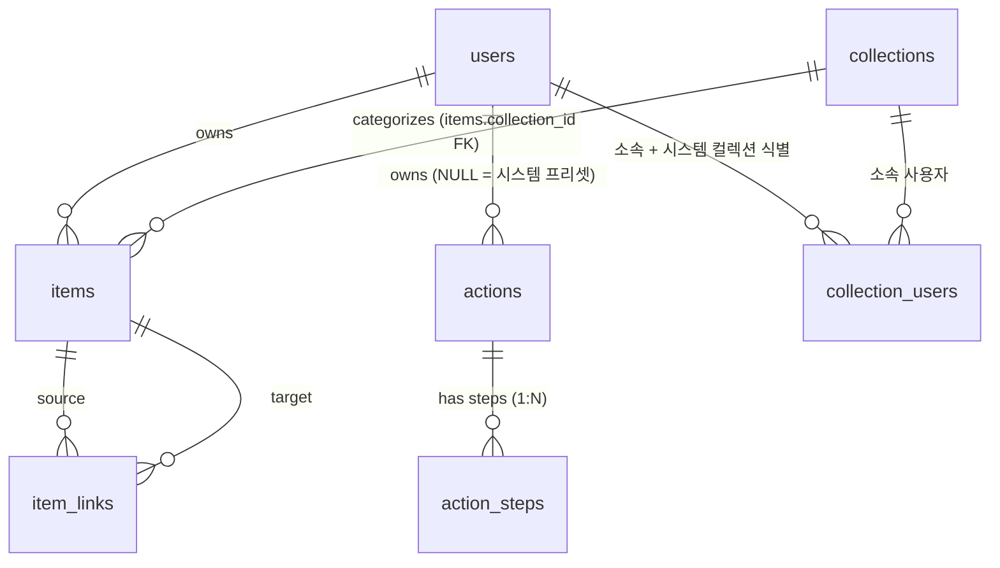

# 데이터 모델 v1.11

> **목적:** 개념 모델을 DB 엔티티로 풀어낸다. 백엔드 스키마·API의 단일 진실 소스.
> 

> **근거:** ADR-17·ADR-18·ADR-19·ADR-21·ADR-22·ADR-23·ADR-24·ADR-29 · 개념 모델 v1.3
> 

> **베이스:** PostgreSQL · Spring Boot · JSONB
> 

> **상태:** v1.12 (2026-07-09 ADR-040 — `view_configs.dashboard.grid` = `{cols:8}` 유동 컴럼·rows 무제한·세로 스크롤) · v1.11 (2026-07-08 ADR-039 — `attributes.recurrence` 구조체 통일: 구 `repeat_rule`·`day_of_week` 흡수, 시간표=Eager/일반=Lazy 펼침, 미해결 #3 종결) · v1.10 (2026-07-06 개념 모델 v1.3 반영 — actions.end_view 제거·action_steps.display_order) · v1.9 (2026-07-06 ADR-034 — view_configs.{module}.density 뷰별 밀도 키 노트) · v1.8 (2026-06-24 ADR-029) · v1.7 확정 (2026-05-21)
> 

---

## 1. 엔티티 개요

| 계층 | 엔티티 | DB 저장 | 비고 |
| --- | --- | --- | --- |
| **아이템** | `items` · `item_links` | ✅ | 모든 데이터의 핵심 |
| 뷰 | (코드 상수) | ❌ | 코드로 정의 |
| 블럭 | (코드 상수) | ❌ | 코드로 정의 (사용자가 새 블럭 생성 불가) |
| **액션** | `actions` · `action_steps` | ✅ | 프리셋·사용자 액션 동일 테이블 |
| 트리거 | (뷰 메타에 포함, 코드 상수) | ❌ | 각 뷰가 선언 |
| **사용자** | `users` | ✅ | 인증·소유권 · 시스템 캘린더 FK 보유 |
| **컬렉션** | `collections` · `collection_users` | ✅ | 아이템 묶음 단위 통합 테이블 (v1.6, ADR-23). `kind` enum으로 calendar/notebook/semester 종류 구분, attributes JSONB로 종류별 추가 필드. collection_users 다대다 (공유 시나리오 인프라) |

### DB 저장 vs. 정적 코드 저장

5계층을 두 그룹으로 나눌 수 있다. 한쪽은 **코드**에 정의되고, 다른 쪽은 **DB**에 저장된다.

| 컬렉션 | 계층 | 어디에 정의되나 | 누가 만드나 |
| --- | --- | --- | --- |
| 📦 데이터 그룹 | 아이템, 액션, 컬렉션 | PostgreSQL 테이블 | 사용자 누구나 |
| 🔧 코드 정의 그룹 | 뷰, 블럭, 트리거 | Spring Boot 코드 (클래스·enum·메타) | 베드락 개발팀만 |

---

## 2. `items` 테이블 — 모든 아이템의 단일 본체

```sql
CREATE TABLE items (
  id            UUID PRIMARY KEY DEFAULT gen_random_uuid(),
  name          TEXT,
  owner_id      UUID NOT NULL REFERENCES users(id),
  collection_id      UUID REFERENCES collections(id) ON DELETE SET NULL,  -- v1.6, ADR-23
  attributes    JSONB NOT NULL DEFAULT '{}',
  created_at    TIMESTAMPTZ NOT NULL DEFAULT NOW(),
  updated_at    TIMESTAMPTZ NOT NULL DEFAULT NOW(),
  deleted_at    TIMESTAMPTZ
);

CREATE INDEX idx_items_owner ON items(owner_id) WHERE deleted_at IS NULL;
CREATE INDEX idx_items_collection_id ON items(collection_id);
CREATE INDEX idx_items_attributes_gin ON items USING GIN(attributes);
```

> **ADR-19 적용:** `type` 컬럼 제거. 아이템의 성격은 attributes 안의 필드 보유로 결정 (Primary Field 추론 룰, 응용 레벨). `title` → `name` 이름 정렬.
> 

### MVP 필드 카탈로그 — 공통 필드 + 모듈 특정 필드 (v1.2)

ADR-19에 따라 attributes는 평탄한 key-value 구조.

**이름 컨벤션 (v1.2 신설):**

- **공통 필드** = 모든 모듈이 type-agnostic하게 보유 가능. 이름 그대로 (`name`, `tags`).
- **모듈 전용 필드** = 특정 모듈에서만 의미. `<module>_<field>` 패턴으로 prefix.

| 구분 | attributes 필드 | 출처 모듈 |
| --- | --- | --- |
| **공통 필드** | `name`, `tags` (TEXT[]) | 모든 모듈 |
| 일정성 | `start_at`, `end_at`, `recurrence` (JSONB 구조체, ADR-039), `alarm`, `location`, `color` | 캘린더 모듈 |
| 투두성 | `status` (open/in_progress/done/archived), `due_at`, `start_at`, `end_at`, `priority` (1-5), `recurrence`, `alarm` | 투두 모듈 |
| 메모성 | `content` (마크다운 원본) | 메모 모듈 — VSCode 편집 모델 |
| 시간표성 | `recurrence` (JSONB, `freq=WEEKLY`+`byday` — 구 `day_of_week` 대체, ADR-039), `start_time` (TIME), `end_time` (TIME), `room`, `instructor` | 시간표 모듈 — 강의명은 공통 필드 `name` 사용 (v1.3, `course_name` 폐기) |

> **다중 필드 보유:** 한 아이템이 여러 그룹 필드를 동시 가질 수 있음 (예: `content` + `start_at` = 일기).
> 

> **필드 중복:** `start_at`·`end_at`·`repeat_rule`·`alarm`은 캘린더·투두 공유. 같은 필드명 = 같은 의미 (ADR-19/ADR-20 컨벤션). 컬렉션 소속은 정식 `items.collection_id` 컬럼으로 분리 (v1.6, ADR-23) — attributes에 없음.
> 

> **필드 중복:** `start_at`·`end_at`·`recurrence`·`alarm`은 캘린더·투두 공유. 같은 필드명 = 같은 의미. 컬렉션 소속은 정식 `items.collection_id` 컬럼으로 분리 (v1.6).
> 

> 
> 

> **확장성:** 새 모듈 추가 시 attributes JSONB에 새 필드만 정의. 테이블 변경 불필요.
> 

### 메모 추가 규칙 (ADR-19 이후, v1.3 편집 모델 개정 반영)

- `attributes.content` = 마크다운 원본 텍스트
- 베드락 메모 편집 모델 = **마크다운 실시간 렌더링 + 슬래시(`/`) 명령어 + 위키링크(`[[]]`)**
- 위키링크 = `[[item:id|alias]]` 인라인 형식. 메모 저장 시 `content` 파싱 → `item_links` 테이블에 `link_type='reference'` 자동 등록·갱신·삭제
- 복사·붙여넣기 최적화 — 항상 마크다운 원본 그대로 클립보드로
- 상세 UX·MVP 슬래시 명령어 목록·블럭 모드 정합은 모듈 상세 기획서(Stage 1 #3) 메모 모듈 항목에서

### 핵심 규칙

- **PATCH는 JSONB 머지** — `UPDATE items SET attributes = attributes || $1::jsonb WHERE id = $2`. 통째 교체 금지
- **소프트 삭제** — `deleted_at IS NULL`로 정상 조회 필터
- **history는 별도 테이블로** (미해결 #1 참조)

### 반복 규칙 `recurrence` — 구조체 + 인스턴스 펼침 (ADR-039, v1.11)

반복(시간표 주간·일반 반복)은 **단일 구조체 `attributes.recurrence`로 통일** — 별도 테이블 아님(ADR-19 flat JSONB 정합, `alarm` 선례). 구 `repeat_rule`(TEXT RRULE)·`day_of_week`(SMALLINT) 흡수.

```json
"recurrence": {
  "freq":     "WEEKLY",
  "interval": 1,
  "byday":    ["MO", "WE", "FR"],
  "until":    "2026-06-20",
  "count":    null
}
```

- **freq** = `"WEEKLY"` | `"DAILY"` · **interval** = 간격(DAILY+interval=n = "n일마다") · **byday** = WEEKLY 요일(구 day_of_week 대체) · **until/count** = 경계(택1, 없으면 무한).
- **진입 UI 2종 → 같은 구조 (ADR-039):** n일 간격 = `{freq:"DAILY", interval:n}` · 주간 요일 = `{freq:"WEEKLY", byday:[...]}`. 시간표는 `until = 학기 collection.attributes.end_date`.
- **`byday` = 다중 요일** (ADR-038 요일 다중 선택) — 시간표 course 1개가 MWF를 한 아이템으로 보유. `byday` 값은 RFC 5545(MO·TU·WE·TH·FR·SA·SU).

**인스턴스 펼침 전략 (미해결 #3 종결):**

| 맥락 | 전략 | 저장 |
| --- | --- | --- |
| **시간표 (주간·학기 경계)** | **Eager** — course 생성 시 `byday × 학기 주차`만큼 캘린더 인스턴스 item 일괄 생성 | 인스턴스 = 별도 items(`start_at`/`end_at`) + `item_links.derived_from` → 마스터(course) |
| **일반 반복 (캘린더·투두)** | **Lazy** — 마스터만 `recurrence` 보유, 인스턴스 미저장, 조회 시 범위 내 계산(RRULE 평가). MVP 밖(후순위) | 마스터 items 1행 |
- 마스터 = `recurrence` 보유 아이템(시간표=course, 시간표 뷰 표시 / 일반=원본 일정·투두). Eager 인스턴스 = `start_at`/`end_at` 보유 캘린더 아이템.
- **잔여 (별개 미해결):** #9 인스턴스 캘린더 소속 · #10 마스터 수정 시 인스턴스 충돌(보존/재생성/선택).

---

## 3. `item_links` 테이블 — 양방향 백링크

```sql
CREATE TABLE item_links (
  id              UUID PRIMARY KEY DEFAULT gen_random_uuid(),
  source_item_id  UUID NOT NULL REFERENCES items(id) ON DELETE CASCADE,
  target_item_id  UUID NOT NULL REFERENCES items(id) ON DELETE CASCADE,
  link_type       VARCHAR(32) NOT NULL,
  created_at      TIMESTAMPTZ NOT NULL DEFAULT NOW(),
  UNIQUE(source_item_id, target_item_id, link_type)
);

CREATE INDEX idx_item_links_source ON item_links(source_item_id);
CREATE INDEX idx_item_links_target ON item_links(target_item_id);
```

### link_type 초안

| link_type | 의미 | 예시 |
| --- | --- | --- |
| `reference` | 단순 참조 | 메모 위키링크 (`[[item:id |
| `parent_child` | 계층 관계 | 시험 D-30 동작 → 그 안의 일정·투두 |
| `derived_from` | 파생 (인스턴스화) | 시간표 → 캘린더 인스턴스 (v1.3, 시간표 모듈 Eager 인스턴스화 · recurrence §2) |

> **ADR-19 적용:** `composite` link_type 폐기. 복합 아이템 개념은 "한 아이템이 여러 그룹 필드 보유"로 흡수됨.
> 

### 규칙

- **수동 연결 우선** — 자동 추론은 중기 이후
- **양방향성** — 단일 레코드가 양방향 의미

---

## 4. `actions` 테이블 — 모든 액션 (프리셋·사용자 동일)

```sql
CREATE TABLE actions (
  id                 UUID PRIMARY KEY DEFAULT gen_random_uuid(),
  name               TEXT NOT NULL,
  description        TEXT,
  owner_id           UUID REFERENCES users(id),  -- NULL이면 시스템 프리셋
  is_preset          BOOLEAN NOT NULL DEFAULT FALSE,
  created_at         TIMESTAMPTZ NOT NULL DEFAULT NOW(),
  updated_at         TIMESTAMPTZ NOT NULL DEFAULT NOW(),
  deleted_at         TIMESTAMPTZ
);

CREATE INDEX idx_actions_owner ON actions(owner_id) WHERE deleted_at IS NULL;
CREATE INDEX idx_actions_preset ON actions(is_preset) WHERE is_preset = TRUE;
```

> `end_view` 컬럼 제거 — 생성 후 항상 트리거 발생 뷰로 복귀 (개념 모델 v1.3). `trigger_signature` 컬럼도 제거 — 트리거는 뷰 코드에서 선언, 강제 매칭 없음.
> 

### 프리셋 액션 처리

- **프리셋도 일반 액션 데이터.** 차이는 `is_preset = TRUE` + `owner_id = NULL` 표시뿐
- 등록·수정·삭제는 일반 `/api/actions` CRUD API로 처리되며, **관리자 권한(`users.role = 'admin'`) 필요**
- 일반 사용자는 `is_preset = TRUE` 레코드를 읽기만 가능

---

## 5. `action_steps` 테이블 — 액션의 블럭 조합

```sql
CREATE TABLE action_steps (
  id              UUID PRIMARY KEY DEFAULT gen_random_uuid(),
  action_id       UUID NOT NULL REFERENCES actions(id) ON DELETE CASCADE,
  display_order   INTEGER NOT NULL,  -- UI 표시 순서 (파이프라인 실행 순서 아님)
  block_type      VARCHAR(32) NOT NULL,  -- calendar, todo, memo, timetable
  config          JSONB NOT NULL DEFAULT '{}',
  UNIQUE(action_id, display_order)
);

CREATE INDEX idx_action_steps_action ON action_steps(action_id, display_order);
```

### config JSONB 예시

| block_type | config 필드 |
| --- | --- |
| `calendar` | `repeat_enabled`, `default_alarm_minutes` |
| `todo` | `repeat_enabled`, `default_priority` |
| `memo` | `template` |
| `timetable` | `semester_filter` |

---

## 6. `users` 테이블 — 인증·소유권

```sql
CREATE TABLE users (
  id                    UUID PRIMARY KEY DEFAULT gen_random_uuid(),
  email                 VARCHAR(255) UNIQUE NOT NULL,
  name                  TEXT,
  password_hash         TEXT,
  role                  VARCHAR(16) NOT NULL DEFAULT 'user',  -- 'user' | 'admin'
  view_configs          JSONB NOT NULL DEFAULT '{}',
  created_at            TIMESTAMPTZ NOT NULL DEFAULT NOW(),
  updated_at            TIMESTAMPTZ NOT NULL DEFAULT NOW(),
  deleted_at            TIMESTAMPTZ
);

CREATE INDEX idx_users_email ON users(email) WHERE deleted_at IS NULL;
```

> **시스템 컬렉션 식별 (v1.7, ADR-24):**
> 

> - users 테이블의 `default_*_collection_id` FK 3개 폐기 — 순환 의존성 해결
> 

> - 시스템 컬렉션 식별은 `collection_users.system_purpose` 컬럼으로 흡수
> 

> - 사용자별 각 system_purpose는 정확히 1개 (partial unique index)
> 

> 
> 

> **`view_configs.dashboard` (v1.5, ADR-22 · ADR-029):** 대시보드 위젯 토글·**그리드 배치**(그리드 좌표·span — ADR-029/D2 · **4:3 고정→유동 8컴럼·행 무제한 세로 스크롤 ADR-040**, `grid` = `{cols:8}`)를 `users.view_configs` JSONB의 `dashboard` 섹션에 저장. (v1.4의 `dashboard_config` 컬럼은 v1.5에서 `view_configs.dashboard`로 흡수 — **별도 컬럼 아님**.) 구조 예시는 대시보드 모듈 §6.1. 좌표·span 추가는 JSONB 키 확장(테이블 변경 없음, forward-compat).
> 

> 
> 

> **`view_configs.{module}.density.{view}` (v1.9, ADR-034):** 뷰(모드)별 **밀도 프리셋 오버라이드** — 값 = `"compact" | "standard" | "comfortable" | null`. 예: `view_configs.calendar.density = {"month": "compact", "week": null}`. `null`(미설정) = 시스템 뷰별 기본값 폴백(월=compact·주/일=standard, ADR-034 — 기본값 튜닝이 미조정 사용자에게 자동 반영). **MVP는 키만 선반영**(조정 UI 없음 — ADR-029식 forward-compat 슬라이스), JSONB 키 확장이라 테이블 변경 없음. 조정 UI(모듈 설정 뷰 옵션 3단 세그먼트)는 현 단계 내 후속(#9).
> 

---

## 6.5 `collections` 테이블 — 컬렉션 통합 단위 (v1.6, ADR-23)

```sql
CREATE TABLE collections (
  id          UUID PRIMARY KEY DEFAULT gen_random_uuid(),
  kind        TEXT NOT NULL CHECK (kind IN ('calendar', 'notebook', 'semester')),
  name        TEXT NOT NULL,
  color       TEXT,  -- 컬렉션 기본 색 (예: 캘린더 색). 소속 아이템이 상속
  icon        TEXT,
  attributes  JSONB NOT NULL DEFAULT '{}',
  created_at  TIMESTAMPTZ NOT NULL DEFAULT NOW(),
  updated_at  TIMESTAMPTZ NOT NULL DEFAULT NOW(),
  deleted_at  TIMESTAMPTZ
);

CREATE INDEX idx_collections_kind ON collections(kind);
CREATE INDEX idx_collections_attributes_gin ON collections USING GIN(attributes);
```

v1.5의 `calendars`·`notebooks`·`semesters` 3 테이블을 단일 `collections`로 통합 (ADR-23).

> **아이템 색 해석 (2-tier):** 아이템 렌더 색 = `items.attributes.color`(아이템 오버라이드) → 없으면 소속 `collections.color`(캘린더 색) 상속 → (둘 다 없으면 시스템 기본색). 아이템 색이 캘린더 색보다 우선. [calendar.md](http://calendar.md) §6 정합.
> 

### kind enum과 종류별 attributes

| kind | 의미 | attributes 안 추가 필드 |
| --- | --- | --- |
| `calendar` | 일정 컬렉션 | — |
| `notebook` | 메모 컬렉션 | — |
| `semester` | 학기 컬렉션 | `start_date`, `end_date` |

### 자동 생성 정책

- **가입 시 자동 생성:** `kind='calendar'` "기본" + `kind='notebook'` "기본" 컬렉션 각 1개
- **투두 첫 시간 입력 시:** `kind='calendar'` "투두" 컬렉션 자동 생성 (system_purpose='todo_calendar')
- **`kind='semester'` 자동 생성 없음** — 시작·종료일 필수, 첫 시간표 입력 시 학기 생성 모달 선행

---

## 6.6 `collection_users` 테이블 — 다대다 중계 (v1.6, ADR-23)

```sql
CREATE TABLE collection_users (
  collection_id   UUID NOT NULL REFERENCES collections(id) ON DELETE CASCADE,
  user_id         UUID NOT NULL REFERENCES users(id) ON DELETE CASCADE,
  role            TEXT NOT NULL DEFAULT 'owner' CHECK (role IN ('owner', 'editor', 'viewer')),
  system_purpose  TEXT CHECK (system_purpose IN ('default_calendar', 'todo_calendar', 'default_notebook') OR system_purpose IS NULL),
  joined_at       TIMESTAMPTZ NOT NULL DEFAULT NOW(),
  PRIMARY KEY (collection_id, user_id)
);

CREATE INDEX idx_collection_users_user_id ON collection_users(user_id);

CREATE UNIQUE INDEX idx_collection_users_system_purpose
  ON collection_users(user_id, system_purpose)
  WHERE system_purpose IS NOT NULL;
```

### role 값

| role | 의미 | MVP 활용 |
| --- | --- | --- |
| `owner` | 컬렉션 소유자 (생성·삭제 권한) | ✅ |
| `editor` | 편집 가능 | ⏳ 후기 공유 |
| `viewer` | 읽기 전용 | ⏳ 후기 공유 |

---

## 7. 관계 다이어그램

### 7.1 핵심 ERD



### 7.3 액션 실행 흐름 (API 수준)

1. 사용자가 뷰에서 트리거 발생 (예: `date_double_click`)
2. 뷰 → API: `POST /api/actions/{id}/execute` + payload
3. API → action_steps: 블럭 조합 로드 (`display_order` 순)
4. 블럭 속성을 의미 그룹으로 병합 → 단일 입력 화면 표시 (트리거 페이로드로 관련 속성 초기값 채움)
5. 사용자 입력 완료
6. API → items: INSERT (attributes = 모든 블럭 속성 병합)
7. 트리거 발생 뷰로 복귀 + 생성 완료 모달 표시

---

## 8. 핵심 API 엔드포인트 (스키마 차원)

### 아이템

```
GET    /api/items                  ?type=&attrs.{key}.{op}=&cursor=
POST   /api/items
GET    /api/items/{id}
PATCH  /api/items/{id}             ← JSONB 머지
DELETE /api/items/{id}             ← soft delete

POST   /api/items:bulkCreate
PATCH  /api/items:bulkUpdate
DELETE /api/items:bulkDelete

GET    /api/items/{id}/links
POST   /api/items/{id}/links
DELETE /api/links/{id}
```

### 액션

```jsx
GET    /api/actions                ?owner=me&is_preset=&cursor=
POST   /api/actions
GET    /api/actions/{id}
PATCH  /api/actions/{id}            ← 프리셋은 admin만
DELETE /api/actions/{id}            ← 프리셋은 admin만

POST   /api/actions/{id}/execute
```

### 컬렉션 (통합)

```jsx
GET    /api/collections                 ?kind=&owner=me&cursor=
POST   /api/collections
GET    /api/collections/{id}
PATCH  /api/collections/{id}
DELETE /api/collections/{id}

GET    /api/collections/{id}/users
POST   /api/collections/{id}/users
DELETE /api/collections/{id}/users/{user_id}
```

### 메타 (정적 데이터)

```jsx
GET    /api/meta/views             ← 7뷰 + 각 뷰의 트리거 목록
GET    /api/meta/blocks            ← 블럭 모드 지원 모듈의 채움 필드
GET    /api/meta/fields            ← MVP 필드 카탈로그
```

---

## 9. 인덱스 전략

| 인덱스 | 목적 |
| --- | --- |
| `idx_items_owner` | "내 아이템 전체" 빠른 조회 |
| `idx_items_attributes_gin` | JSONB 내부 필드 검색 |
| `idx_item_links_source/target` | 백링크 양방향 조회 |
| `idx_actions_owner` | 내 액션 라이브러리 조회 |
| `idx_actions_preset` | 프리셋 카탈로그 조회 |
| `idx_action_steps_action` | 액션 블럭 조합 조회 (`display_order` 순) |
| `idx_collections_kind` | 컬렉션 종류별 조회 (v1.6) |
| `idx_collections_attributes_gin` | 컬렉션 attributes JSONB 검색 (v1.6) |
| `idx_items_collection_id` | items의 컬렉션 소속 조회 (v1.6) |
| `idx_collection_users_user_id` | 사용자별 소속 컬렉션 목록 조회 (v1.6) |
| `idx_collection_users_system_purpose` | 사용자별 시스템 컬렉션 식별 — partial unique on (user_id, system_purpose) (v1.7, ADR-24) |

---

## 10. 미해결 항목

| # | 항목 | 영향 | 처리 |
| --- | --- | --- | --- |
| 1 | **history 테이블 설계** | 아이템 변경 이력·동작 출처 추적 | 별도 `item_histories` 테이블 후보. MVP 단계 미구현 |
| 2 | ~~시간표 vs 캘린더 데이터 관계~~ | ~~items.type~~ | ✅ 해결 (ADR-19) |
| 3 | ~~반복 일정 인스턴스 저장 방식~~ | ~~items 양 폭증 가능성~~ | ✅ 해결 (ADR-039) — 시간표=Eager(주차 일괄 생성+`derived_from`) / 일반 반복=Lazy(조회 시 평가). `recurrence` 구조체 §2 |
| 4 | 인증 방식 | users 테이블 필드 | 미정 |
| 5 | 사용자 액션 조립 검증 | 중기 기능 | 후순위 |
| 6 | 메모 외부→내부 변환 정책 | 메모 모듈 UX | 메모 모듈 §7로 위임 |
| 7 | `~~pinned` (상단 고정) 설계~~ | ~~모든 모듈, 사이드바·홈 UI~~ | ✅ 해결 (v1.5, ADR-22) |
| 8 | `~~users.default_semester_id` 도입 여부~~ | ~~users 테이블, 시간표 모듈 UX~~ | ✅ 해결 (v1.5, ADR-22) |
| 9 | **시간표 → 캘린더 인스턴스 캘린더 소속** | 시간표 모듈 인스턴스화 | 인스턴스 캘린더 아이템의 `calendar_id` = 사용자 default vs 시간표별 지정 |
| 10 | **시간표 수정 시 인스턴스 충돌 처리** | 시간표 모듈 인스턴스화 | (a) 사용자 수정 보존 (b) 일괄 재생성 (c) 사용자 선택 |
| 11 | **~~Primary Field 추론 룰 케이스 모음~~** | `~~actions.end_view` 자동 추론~~ | ✅ 해결 — `end_view` 컬럼 제거, 항상 트리거 발생 뷰로 복귀 (개념 모델 v1.3) |

---

## 11. 후속 문서로의 연계

| 후속 문서 | 가져갈 것 |
| --- | --- |
| 기능 명세서 (모듈 상세) | 각 모듈의 attributes 필드 정의. 모듈별 트리거 목록·페이로드. **메모 모듈은 VSCode 편집 모델 UX 별도 정의** |
| IA | `/api/meta/views`로 7뷰 진입점 매핑 |
| 사용자 시나리오 | 페르소나별 데이터 흐름을 items·actions 관점에서 |
| Flowchart | 액션 실행 API 호출 흐름 |
| 상태머신 | items.attributes.status 전이 (투두), actions 실행 상태 |
| 인터랙션 명세 | JSONB 머지 같은 백엔드 규칙이 프론트 PATCH 호출에 미치는 영향 |

---

**버전:** v1.12 | **갱신일:** 2026-07-09 | **v1.11→v1.12:** ADR-040 — `view_configs.dashboard.grid` 유동 8컴럼(`{cols:8}`·rows 무제한·세로 스크롤). | **v1.10→v1.11:** ADR-039 — `attributes.recurrence` JSONB 구조체 통일(구 `repeat_rule`·`day_of_week` 흡수), 시간표=Eager/일반=Lazy 인스턴스 펼침, 미해결 #3 종결. | **v1.9→v1.10:** 개념 모델 v1.3 반영 — `actions.end_view` 컬럼 제거(항상 트리거 발생 뷰 복귀), `action_steps.step_order` → `display_order` rename, §7.3 액션 실행 흐름에서 컨텍스트 누적 제거. | **v1.8→v1.9:** ADR-034 — `view_configs.{module}.density.{view}` 뷰별 밀도 프리셋 키(forward-compat·테이블 변경 없음·MVP는 키만 선반영). | **v1.7→v1.8:** ADR-029 — `view_configs.dashboard`에 8×6 그리드 좌표·span 키. | **v1.6→v1.7:** ADR-24 컬렉션 명칭 변경 + users 순환 의존성 해결.